# 导览模块交互流程图

> **项目**: YiTiJi_Move
> **模块路径**: `Assets/c#/SystemLayer/Guide/`
> **生成时间**: 2026-02-18

---

## 一、模块总览图

展示导览模块各组件之间的关系和数据流向。

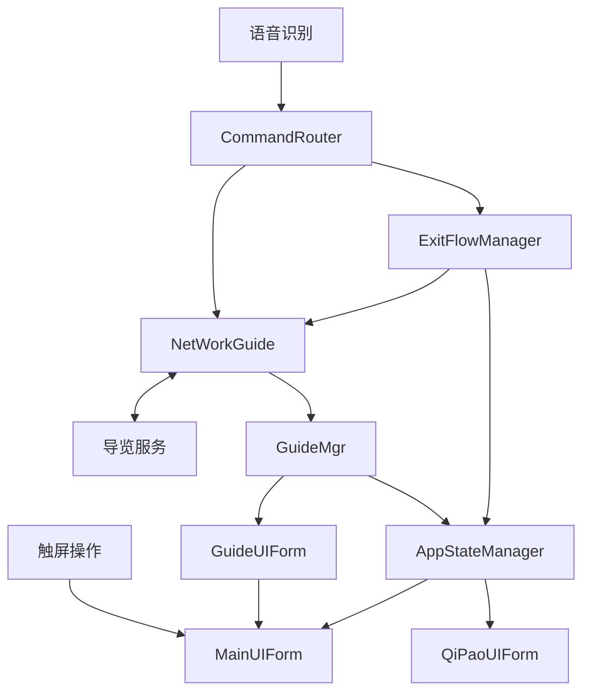

### 核心组件说明

| 组件 | 文件 | 职责 |
|------|------|------|
| **GuideMgr** | `GuideMgr.cs` | 导览管理器 - 处理导览响应事件、方向判断、点位到达 |
| **NetWorkGuide** | `NetWorkGuide.cs` | WebSocket通信 - 发送/接收导览指令 |
| **GuideUIForm** | `GuideUIForm.cs` | 导览界面 - 管理UI展示、打字机效果、音视频播放 |
| **CommandRouter** | `CommandRouter.cs` | 指令路由 - 语音识别文本→业务指令 |
| **ExitFlowManager** | `ExitFlowManager.cs` | 退出流程 - 不同状态的退出策略 |
| **ExitReason** | `ExitReason.cs` | 退出原因枚举 |

---

## 二、完整交互流程图

从用户触发导览到结束的全流程。

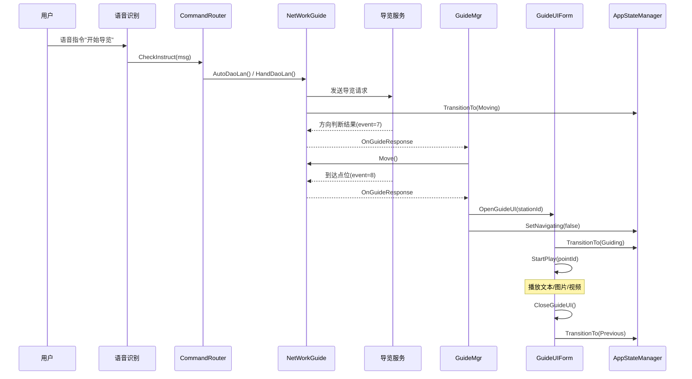

---

## 三、状态机流程图

AppState 状态转换关系（基于 AppStateManager.cs）。

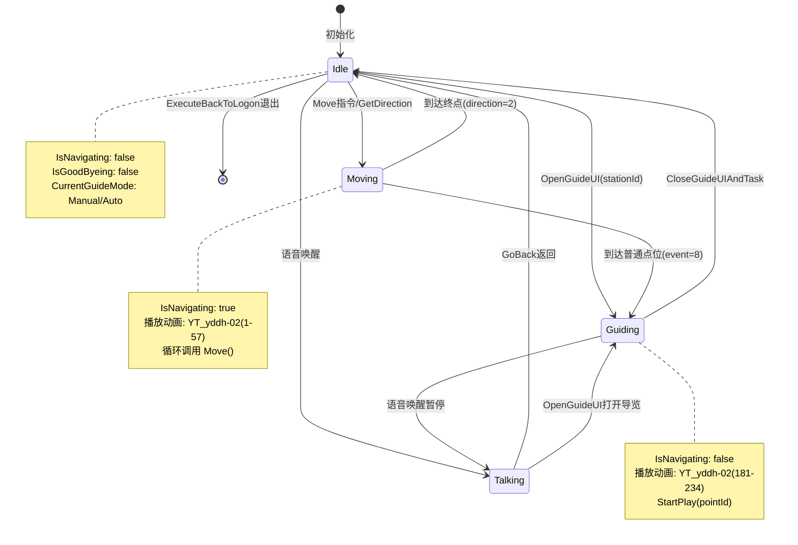

### 状态说明

| 状态 | 含义 | 进入条件 | 退出条件 | 关键标志 |
|------|------|----------|----------|----------|
| **Idle** | 空闲待命 | 初始化/到达终点/关闭UI | Move指令/语音唤醒/到达点位 | `IsNavigating=false` |
| **Moving** | 移动中 | `GetDirection()`返回direction=0/1 | 到达终点/到达点位 | `IsNavigating=true` |
| **Talking** | 对话中 | 语音唤醒触发 | GoBack返回/打开导览UI | 对话界面显示 |
| **Guiding** | 导览播放中 | `HandleArriveNormalStation()` | `CloseGuideUIAndTask()` | `IsNavigating=false` |

### 状态转换触发点

| 触发方法 | 源状态 | 目标状态 | 文件位置 |
|----------|--------|----------|----------|
| `GuideMgr.HandleMoveRight()` | Idle | Moving | GuideMgr.cs:122 |
| `GuideMgr.HandleReachDestination()` | Moving | Idle | GuideMgr.cs:131 |
| `GuideMgr.HandleArriveNormalStation()` | Moving | Guiding | GuideMgr.cs:214 |
| `GuideMgr.OpenGuideUI()` | Talking/Idle | Guiding | GuideMgr.cs:265 |
| `GuideUIForm.CloseGuideUIAndTask()` | Guiding | Idle | GuideUIForm.cs:145 |

### GuideMode 模式说明

| 模式 | 枚举值 | 触发方法 | 行为 |
|------|--------|----------|------|
| **None** | 0 | 初始化 | 无导览模式 |
| **Auto** | 1 | `NetWorkGuide.AutoDaoLan()` | 自动播放各点位 |
| **Manual** | 2 | `NetWorkGuide.HandDaoLan()` | 手动控制导览 |

---

## 四、导览模式流程图

手动/自动/全局三种导览模式的切换和行为。

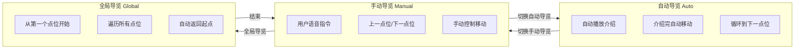

### 导览模式详细说明

#### 手动导览 (HandDaoLan)
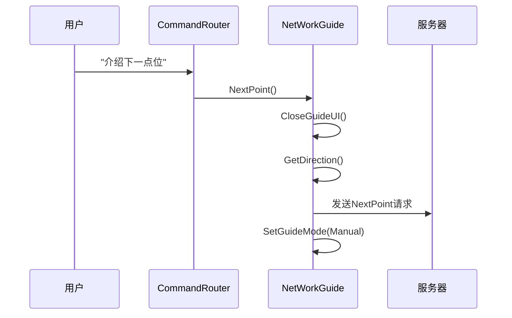

#### 自动导览 (AutoDaoLan)
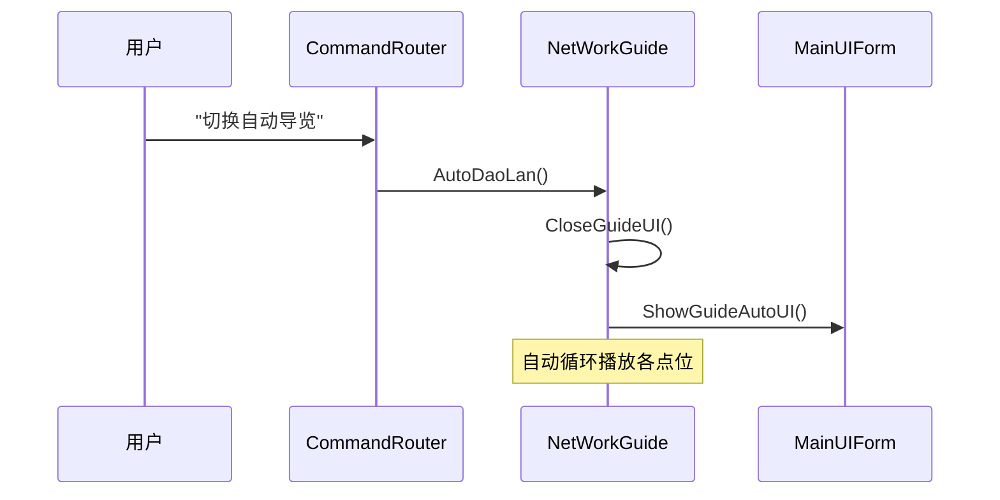

#### 全局导览 (AutoGlobalDaoLan)
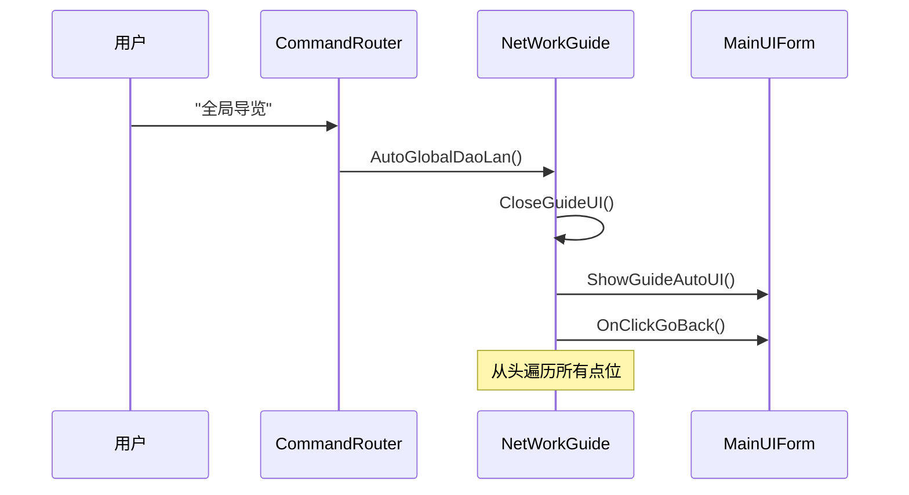

---

## 五、UI播放流程图

GuideUIForm 中文本/图片/视频内容的播放和同步机制。

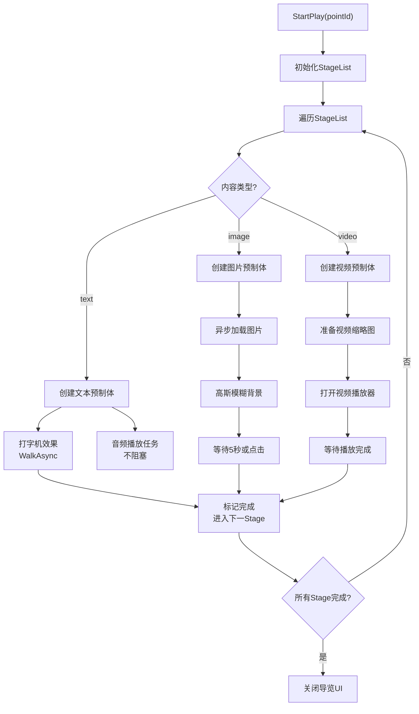

### 内容类型处理详解

#### 文本播放流程
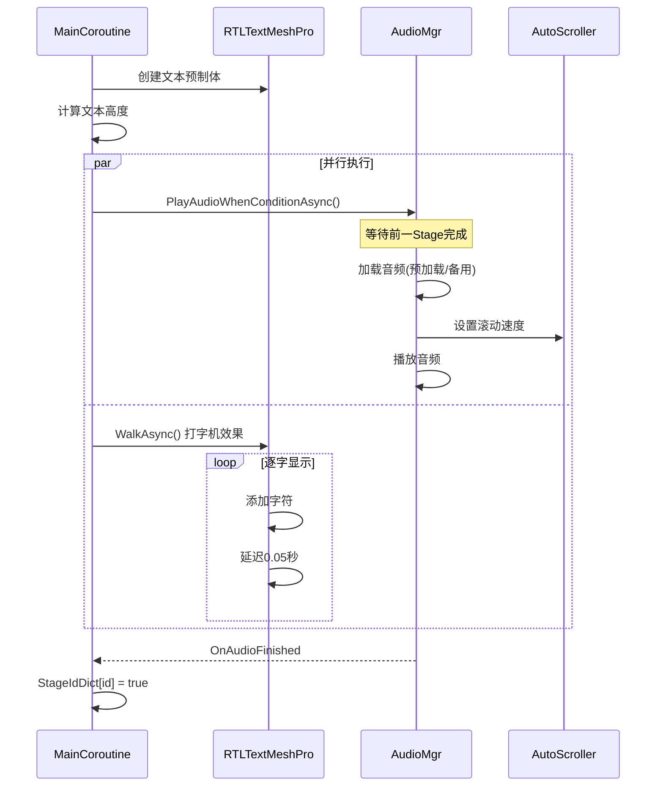

#### 图片播放流程
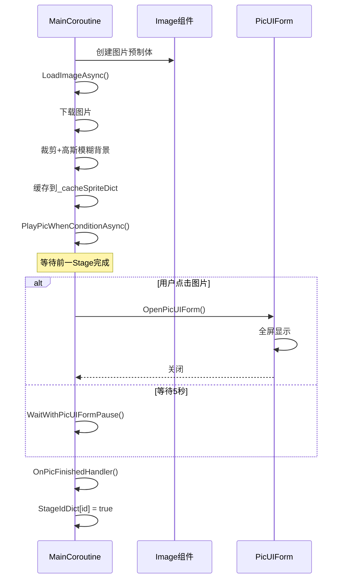

#### 视频播放流程
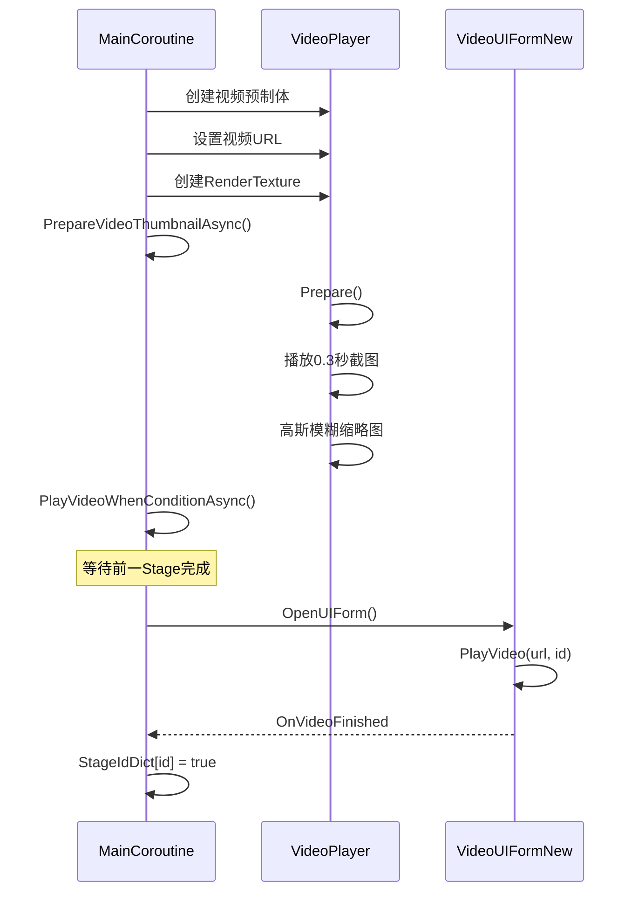

### 暂停/恢复机制

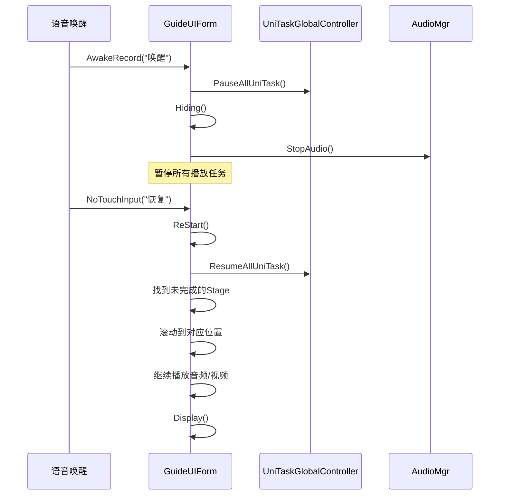

---

## 六、退出流程图

基于 ExitFlowManager.cs 的退出处理策略。

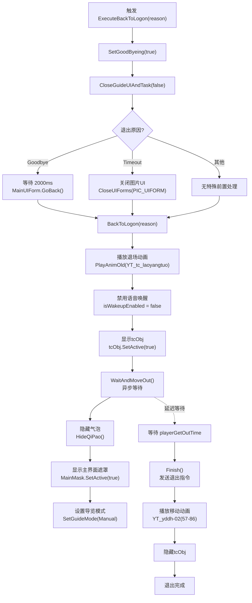

### 退出原因枚举 (ExitReason.cs)

| 原因 | 枚举值 | 触发场景 | 前置处理 | 触发位置 |
|------|--------|----------|----------|----------|
| **Timeout** | 0 | 无操作超时 | 关闭图片UI | 超时检测逻辑 |
| **Goodbye** | 1 | 用户说"再见" | 等待2秒+GoBack | CommandRouter.cs:63 |
| **Manual** | 2 | 点击退出按钮 | 无 | UI按钮事件 |
| **Error** | 3 | 错误导致退出 | 无 | 异常处理 |
| **GuideFinished** | 4 | 导览结束 | 无 | 导览完成检测 |

### 核心退出方法调用链

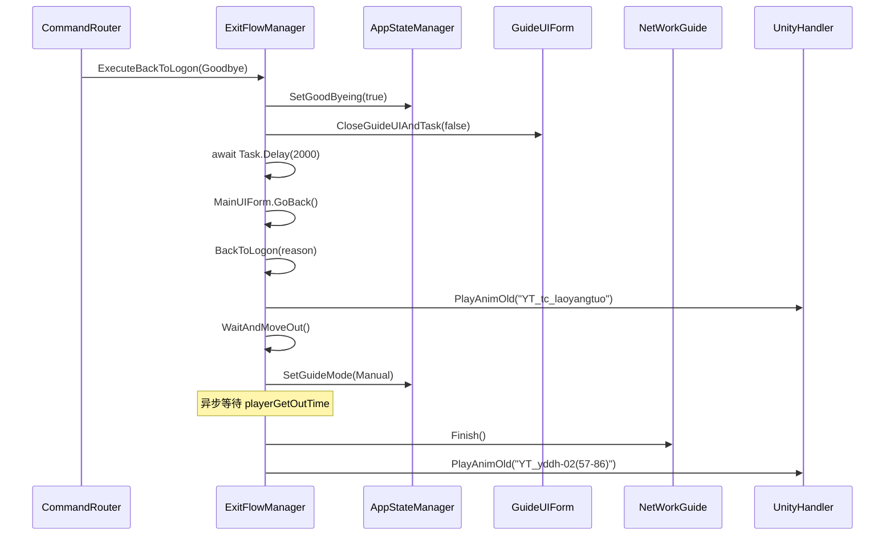

### 关键配置参数

| 参数 | 配置路径 | 说明 |
|------|----------|------|
| `playerGetOutTime` | `JsonManager.Instance.playerData.PlayerConfigs[id].playerGetOutTime` | 退出动画等待时间（毫秒） |
| `ChargeStationId` | `JsonManager.Instance.ChargeStationId` | 充电桩ID |
| `isWakeupEnabled` | `AIKit.VoiceWakeup.isWakeupEnabled` | 语音唤醒开关 |

---

## 七、WebSocket 通信协议

### 发送指令 (DaoLanEvent)

| 事件 | 值 | 说明 | 触发方法 |
|------|-----|------|----------|
| Move | 2 | 开始移动 | `Move()` |
| Pause | 3 | 暂停移动 | `Pause()` |
| GotoPoint | 4 | 前往指定点位 | `GotoPointPur(stationId)` |
| AutoDaoLan | 5 | 自动导览 | `AutoDaoLan()` |
| AutoGlobalDaoLan | 6 | 全局导览 | `AutoGlobalDaoLan()` |
| GetDirection | 7 | 获取方向 | `GetDirection()` |
| HandDaoLan | 9 | 手动导览 | `HandDaoLan()` |
| Finish | 10 | 结束导览 | `Finish()` |
| NextPoint | 11 | 下一点位 | `NextPoint()` |
| FrontPoint | 12 | 上一点位 | `FrontPoint()` |
| GetIsChargeStation | 13 | 获取充电状态 | `GetIsChargeStation()` |

### 接收响应 (GuideResponse.event)

| 事件 | 值 | 说明 | 处理方法 |
|------|-----|------|----------|
| 导览错误 | 0 | 显示错误界面 | `HandleGuideError()` |
| 错误恢复 | 1 | 关闭错误界面 | `HandleGuideErrorRecovery()` |
| 方向判断结果 | 7 | 处理移动方向 | `HandleDirectionResult()` |
| 到达点位 | 8 | 处理到达事件 | `HandleArriveStation()` |
| 切换手动导览 | 9 | 模式切换通知 | 日志记录 |
| 充电状态变化 | 13 | 处理充电状态 | `HandleChargingStateChange()` |

---

## 八、语音指令路由

CommandRouter 支持的语音指令映射。

| 中文指令 | 英文指令 | 执行动作 |
|----------|----------|----------|
| 继续 | goon | `HandleContinue()` |
| 介绍上一点位 | introducethepreviouspoint | `NetWorkGuide.FrontPoint()` |
| 导航到上一点位 | navigatetopreviouspoint | `NetWorkGuide.FrontPoint()` |
| 介绍下一点位 | introducethenextpoint | `NetWorkGuide.NextPoint()` |
| 导航到下一点位 | navigatetonextpoint | `NetWorkGuide.NextPoint()` |
| 再见 | goodbye | `ExitFlowManager.ExecuteBackToLogon()` |
| 切换自动导览 | toggleautoguide | `NetWorkGuide.AutoDaoLan()` |
| 全局导览 | globalguide | `NetWorkGuide.AutoGlobalDaoLan()` |
| 切换手动导览 | togglemanualguide | `NetWorkGuide.HandDaoLan()` |

---

## 九、关键代码引用

### 核心管理类

| 功能 | 文件位置 | 说明 |
|------|----------|------|
| **状态管理** | | |
| 状态转换 | `AppStateManager.cs:43` - `TransitionTo()` | 切换应用状态 |
| 设置导航状态 | `AppStateManager.cs:52` - `SetNavigating()` | 设置IsNavigating标志 |
| 设置告别状态 | `AppStateManager.cs:60` - `SetGoodByeing()` | 设置IsGoodByeing标志 |
| 设置导览模式 | `AppStateManager.cs:67` - `SetGuideMode()` | 切换导览模式 |
| **导览管理** | | |
| 导览响应主入口 | `GuideMgr.cs:68` - `OnGuideResponse()` | 处理服务器响应 |
| 方向判断处理 | `GuideMgr.cs:108` - `HandleDirectionResult()` | event=7方向判断 |
| 向右移动 | `GuideMgr.cs:121` - `HandleMoveRight()` | direction=0/1时移动 |
| 到达终点 | `GuideMgr.cs:131` - `HandleReachDestination()` | direction=2到达终点 |
| 到达点位处理 | `GuideMgr.cs:140` - `HandleArriveStation()` | event=8点位到达 |
| 到达普通点位 | `GuideMgr.cs:214` - `HandleArriveNormalStation()` | 打开导览UI |
| 打开导览UI | `GuideMgr.cs:265` - `OpenGuideUI()` | 显示点位介绍 |
| **网络通信** | | |
| WebSocket连接 | `NetWorkGuide.cs:63` - `InitializeWebSocket()` | 建立WebSocket连接 |
| 移动指令 | `NetWorkGuide.cs:221` - `Move()` | event=2 |
| 暂停指令 | `NetWorkGuide.cs:231` - `Pause()` | event=3 |
| 结束指令 | `NetWorkGuide.cs:241` - `Finish()` | event=10 |
| 获取方向 | `NetWorkGuide.cs:252` - `GetDirection()` | event=7 |
| 前往点位 | `NetWorkGuide.cs:274` - `GotoPointPur()` | event=4 |
| 下一点位 | `NetWorkGuide.cs:286` - `NextPoint()` | event=11 |
| 上一点位 | `NetWorkGuide.cs:300` - `FrontPoint()` | event=12 |
| 手动导览 | `NetWorkGuide.cs:318` - `HandDaoLan()` | event=9 |
| 自动导览 | `NetWorkGuide.cs:331` - `AutoDaoLan()` | event=5 |

### UI播放系统

| 功能 | 文件位置 | 说明 |
|------|----------|------|
| 关闭UI和任务 | `GuideUIForm.cs:145` - `CloseGuideUIAndTask()` | 清理UI和取消任务 |
| 开始播放 | `GuideUIForm.cs:286` - `StartPlay()` | 初始化播放流程 |
| 主循环 | `GuideUIForm.cs:361` - `MainCoroutine()` | 遍历StageList播放 |
| 打字机效果 | `GuideUIForm.cs:470` - `WalkAsync()` | 文本逐字显示 |
| 音频播放 | `GuideUIForm.cs:506` - `PlayAudioWhenConditionAsync()` | 条件音频播放 |
| 视频播放 | `GuideUIForm.cs:630` - `PlayVideoWhenConditionAsync()` | 条件视频播放 |
| 图片播放 | `GuideUIForm.cs:709` - `PlayPicWhenConditionAsync()` | 条件图片播放 |

### 退出流程

| 功能 | 文件位置 | 说明 |
|------|----------|------|
| 退出流程入口 | `ExitFlowManager.cs:16` - `ExecuteBackToLogon()` | 根据原因执行退出 |
| 核心退出逻辑 | `ExitFlowManager.cs:35` - `BackToLogon()` | 统一退出处理 |
| 等待并移出 | `ExitFlowManager.cs:47` - `WaitAndMoveOut()` | 异步等待+Finish |

### 指令路由

| 功能 | 文件位置 | 说明 |
|------|----------|------|
| 指令检查 | `CommandRouter.cs:32` - `CheckInstruct()` | 语音指令→业务逻辑 |
| 再见指令 | `CommandRouter.cs:63` | 触发Goodbye退出 |
| 下一点位指令 | `CommandRouter.cs:57` | 调用NextPoint |
| 上一点位指令 | `CommandRouter.cs:49` | 调用FrontPoint |
| 自动导览指令 | `CommandRouter.cs:69` | 调用AutoDaoLan |
| 手动导览指令 | `CommandRouter.cs:81` | 调用HandDaoLan |

---

*文档由 Craft Agent 自动生成*
