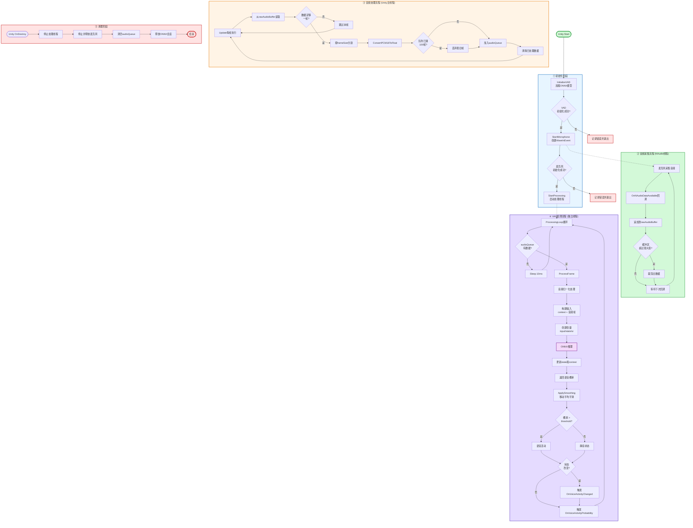

```mermaid
graph TB
    Start([Unity Start]) --> InitVAD[InitializeVAD<br/>加载ONNX模型]
    InitVAD --> CheckVAD{VAD<br/>初始化成功?}
    CheckVAD -->|否| ErrorVAD[记录错误并退出]
    CheckVAD -->|是| StartMic[StartMicrophone<br/>创建WaveInEvent]
    
    StartMic --> CheckMic{麦克风<br/>初始化成功?}
    CheckMic -->|否| ErrorMic[记录错误并退出]
    CheckMic -->|是| StartProc[StartProcessing<br/>启动处理线程]
    
    subgraph init["① 初始化阶段"]
        InitVAD
        CheckVAD
        StartMic
        CheckMic
        StartProc
    end
    
    subgraph capture["② 音频采集流程 (NAudio线程)"]
        MicCapture[麦克风采集音频] --> Callback[OnNAudioDataAvailable回调]
        Callback --> AppendBuffer[追加到rawAudioBuffer]
        AppendBuffer --> CheckSize{缓冲区<br/>超过最大值?}
        CheckSize -->|是| TrimBuffer[裁剪旧数据]
        CheckSize -->|否| WaitNext[等待下次回调]
        TrimBuffer --> WaitNext
        WaitNext --> MicCapture
    end
    
    subgraph process["③ 音频处理流程 (Unity主线程)"]
        UnityUpdate[Update每帧执行] --> ReadBuffer[从rawAudioBuffer读取]
        ReadBuffer --> CheckData{数据足够<br/>一帧?}
        CheckData -->|否| SkipFrame[跳过本帧]
        CheckData -->|是| SplitFrames[按frameSize分割]
        SplitFrames --> Convert[ConvertPCM16ToFloat]
        Convert --> CheckQueue{队列已满<br/>100帧?}
        CheckQueue -->|是| DropFrame[丢弃最旧帧]
        CheckQueue -->|否| Enqueue[加入audioQueue]
        DropFrame --> Enqueue
        Enqueue --> ClearBuffer[清除已处理数据]
        ClearBuffer --> UnityUpdate
        SkipFrame --> UnityUpdate
    end
    
    subgraph vad["④ VAD检测流程 (独立线程)"]
        ProcLoop[ProcessingLoop循环] --> Dequeue{audioQueue<br/>有数据?}
        Dequeue -->|否| Sleep[Sleep 10ms]
        Sleep --> ProcLoop
        Dequeue -->|是| ProcFrame[ProcessFrame]
        
        ProcFrame --> Normalize[音频归一化处理]
        Normalize --> BuildInput[构建输入<br/>context + 音频帧]
        BuildInput --> CreateTensor[创建张量<br/>input/state/sr]
        CreateTensor --> OnnxRun[ONNX推理]
        OnnxRun --> UpdateState[更新state和context]
        UpdateState --> ReturnProb[返回语音概率]
        
        ReturnProb --> Smooth[ApplySmoothing<br/>移动平均平滑]
        Smooth --> Compare{概率 ><br/>threshold?}
        Compare -->|是| VoiceActive[语音活动]
        Compare -->|否| VoiceSilent[静音状态]
        
        VoiceActive --> CheckChange{状态<br/>改变?}
        VoiceSilent --> CheckChange
        CheckChange -->|是| TriggerEvent[触发OnVoiceActivityChanged]
        CheckChange -->|否| TriggerProb[触发OnVoiceActivityProbability]
        TriggerEvent --> TriggerProb
        TriggerProb --> ProcLoop
    end
    
    subgraph cleanup["⑤ 清理阶段"]
        Destroy([Unity OnDestroy]) --> StopThread[停止处理线程]
        StopThread --> StopMic[停止并释放麦克风]
        StopMic --> ClearQueue[清空audioQueue]
        ClearQueue --> DisposeSession[释放ONNX会话]
        DisposeSession --> End([结束])
    end
    
    StartProc -.-> ProcLoop
    StartMic -.-> MicCapture
    
    style init fill:#e7f5ff,stroke:#1971c2,stroke-width:2px
    style capture fill:#d3f9d8,stroke:#2f9e44,stroke-width:2px
    style process fill:#fff4e6,stroke:#e67700,stroke-width:2px
    style vad fill:#e5dbff,stroke:#5f3dc4,stroke-width:2px
    style cleanup fill:#ffe3e3,stroke:#c92a2a,stroke-width:2px
    
    style Start fill:#d3f9d8,stroke:#2f9e44,stroke-width:3px
    style End fill:#ffe3e3,stroke:#c92a2a,stroke-width:3px
    style OnnxRun fill:#f3d9fa,stroke:#862e9c,stroke-width:2px
    style ErrorVAD fill:#ffe3e3,stroke:#c92a2a,stroke-width:2px
    style ErrorMic fill:#ffe3e3,stroke:#c92a2a,stroke-width:2px
```