# 网络代理原理详解：从B站到Claude的完整流程

> [!info] 文档说明
> 本文详细讲解网络代理的工作原理，包括系统代理、TUN模式、规则分流等核心概念，并通过B站和Claude Code的实际案例进行说明。

---

## 📚 目录

- [[#一、网络请求的七层结构]]
- [[#二、无代理情况下的网络访问]]
- [[#三、代理的两种工作模式]]
- [[#四、Clash规则的作用机制]]
- [[#五、实战案例分析]]
- [[#六、常见问题解答]]

---

## 一、网络请求的七层结构

### OSI七层模型（简化版）

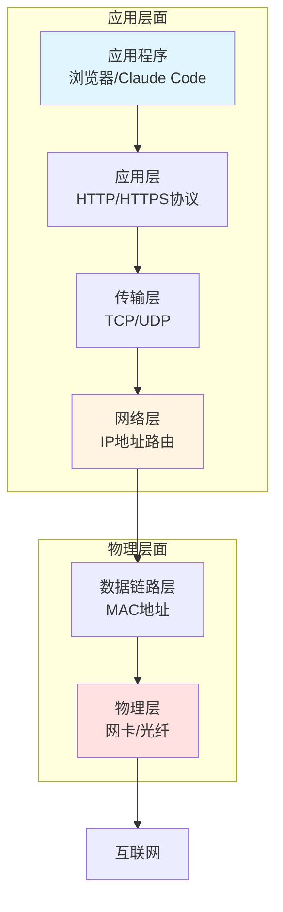

**关键理解**：
- **应用层**：软件发起请求（如Chrome打开bilibili.com）
- **网络层**：决定数据包走哪条路（**代理在这里起作用**）
- **物理层**：真正的网线、WiFi信号

---

## 二、无代理情况下的网络访问

### 场景1：访问B站（bilibili.com）

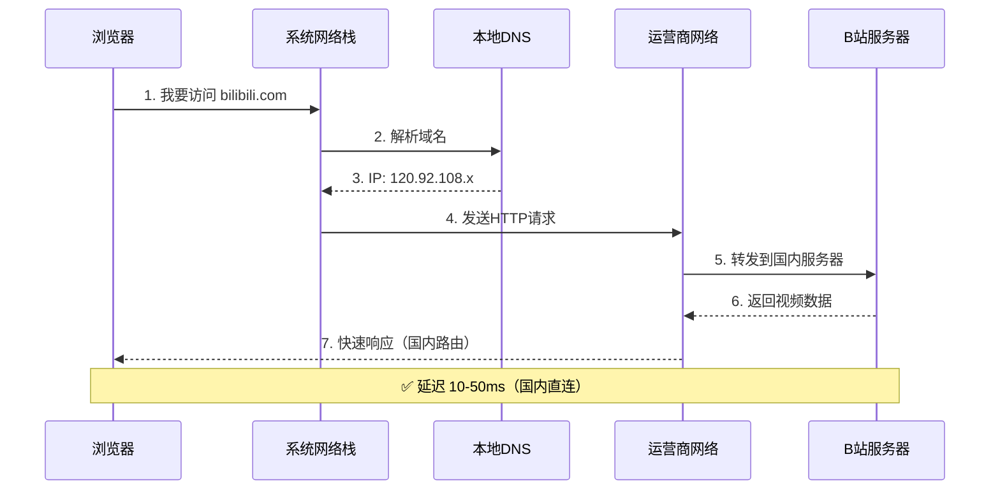

**路径特点**：
- 🚀 **直连**：数据不绕路，走最短路径
- ⚡ **速度快**：国内服务器，延迟低
- 📍 **路由**：运营商智能选择最优线路

---

### 场景2：访问Claude（claude.ai）

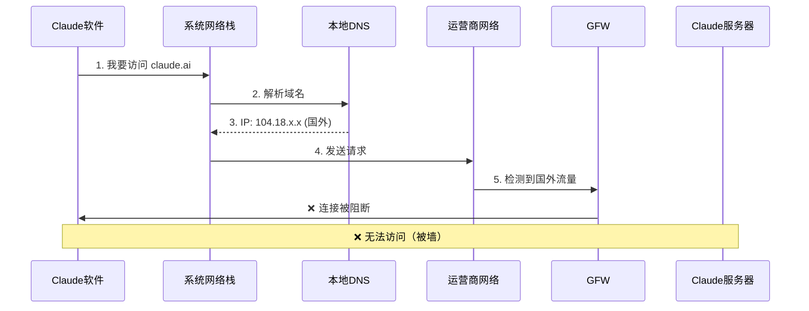

**问题**：
- 🚫 **GFW阻断**：防火墙识别并拦截
- ❌ **直连失败**：无法到达目标服务器
- 🔧 **解决方案**：需要代理绕过封锁

---

## 三、代理的两种工作模式

### 模式对比表

| 特性              | 系统代理模式       | TUN虚拟网卡模式    |
| --------------- | ------------ | ------------ |
| **工作层级**        | 应用层（Layer 7） | 网络层（Layer 3） |
| **拦截点**         | 应用主动查询       | 系统网络栈自动拦截    |
| **应用支持**        | 需要应用支持代理协议   | **所有应用透明支持** |
| **Claude Code** | ❌ 可能不生效      | ✅ 一定生效       |
| **终端工具**        | 需要设置环境变量     | ✅ 自动生效       |
| **配置难度**        | ⭐⭐⭐          | ⭐            |

---

### 3.1 系统代理模式详解

#### 工作流程图

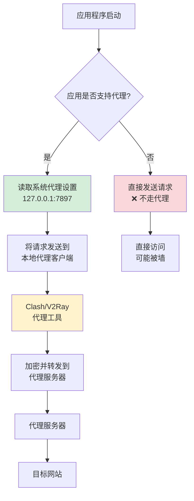

#### 系统代理设置位置

**Windows**：
```
控制面板 → 网络和Internet → 代理设置
- HTTP代理：127.0.0.1:7897
- HTTPS代理：127.0.0.1:7897
```

**问题案例**：
```
✅ Chrome浏览器：会读取系统代理 → ✅ 生效
❌ Claude Code：不读取系统代理 → ❌ 不生效
❌ 某些终端工具：不读取系统代理 → ❌ 不生效
```

---

### 3.2 TUN虚拟网卡模式详解

#### 工作流程图

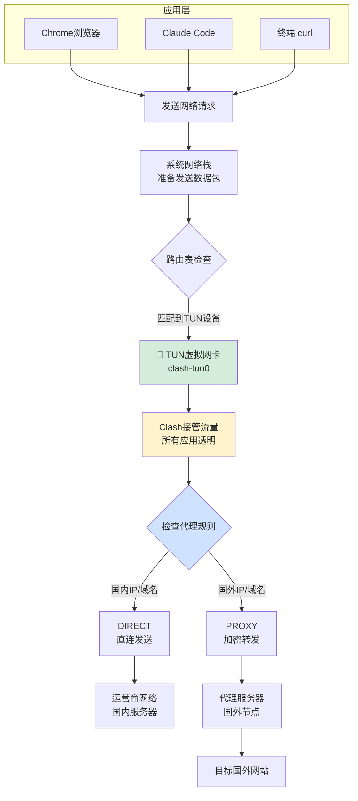

#### TUN模式的魔法

**虚拟网卡是什么？**
```
物理网卡（真实存在）：
├─ WiFi网卡：wlan0
├─ 有线网卡：eth0
└─ 蓝牙网卡：bluetooth0

虚拟网卡（软件模拟）：
└─ TUN设备：clash-tun0  ← Clash创建的"假网卡"
```

**路由表劫持**：
```bash
# 正常路由表
默认网关 → 192.168.1.1 (路由器)

# TUN模式启动后
默认网关 → clash-tun0 (虚拟网卡) ← 优先级更高！
备用路由 → 192.168.1.1 (路由器)
```

**流程解释**：
1. **所有应用**发送网络请求
2. 系统网络栈查路由表 → 发现 TUN 设备优先级最高
3. 数据包被"劫持"到 Clash 软件
4. Clash 根据**规则**决定：直连 or 代理
5. 应用完全不知道中间发生了什么（**透明代理**）

---

## 四、Clash规则的作用机制

### 4.1 规则工作位置图

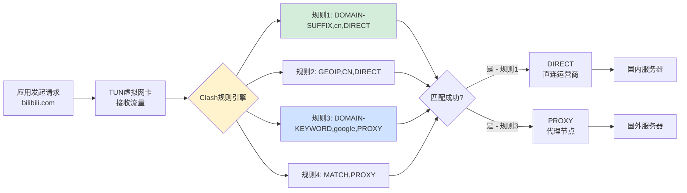

### 4.2 规则类型详解

#### 规则格式

```yaml
规则类型, 匹配内容, 动作
  ↓        ↓       ↓
DOMAIN-SUFFIX, cn, DIRECT
```

#### 常用规则类型

| 规则类型 | 说明 | 示例 | 匹配结果 |
|---------|------|------|---------|
| **DOMAIN-SUFFIX** | 域名后缀匹配 | `DOMAIN-SUFFIX,cn,DIRECT` | `baidu.cn` ✅<br/>`taobao.cn` ✅ |
| **DOMAIN-KEYWORD** | 域名包含关键词 | `DOMAIN-KEYWORD,google,PROXY` | `google.com` ✅<br/>`google.co.jp` ✅ |
| **GEOIP** | IP地理位置 | `GEOIP,CN,DIRECT` | 中国IP段 ✅ |
| **IP-CIDR** | IP地址段 | `IP-CIDR,192.168.0.0/16,DIRECT` | 局域网 ✅ |
| **MATCH** | 兜底规则（匹配所有） | `MATCH,PROXY` | 其他所有流量 |

#### 动作类型

| 动作 | 说明 | 效果 |
|------|------|------|
| **DIRECT** | 直连 | 不走代理，直接连接目标 |
| **PROXY** | 代理 | 通过代理节点转发 |
| **REJECT** | 拒绝 | 拦截连接（常用于广告） |

---

### 4.3 规则执行顺序

> [!important] 关键概念
> Clash规则是**从上到下**依次匹配，**匹配到第一条后立即执行**，不再继续往下。

#### 示例配置

```yaml
rules:
  # 1️⃣ 局域网直连（最高优先级）
  - DOMAIN-SUFFIX,local,DIRECT
  - IP-CIDR,192.168.0.0/16,DIRECT

  # 2️⃣ 国内域名直连
  - DOMAIN-SUFFIX,cn,DIRECT
  - DOMAIN-KEYWORD,baidu,DIRECT
  - DOMAIN-KEYWORD,bilibili,DIRECT
  - DOMAIN-KEYWORD,taobao,DIRECT

  # 3️⃣ 国外常用服务走代理
  - DOMAIN-KEYWORD,google,PROXY
  - DOMAIN-KEYWORD,youtube,PROXY
  - DOMAIN-KEYWORD,claude,PROXY
  - DOMAIN-KEYWORD,github,PROXY

  # 4️⃣ 地理位置规则
  - GEOIP,CN,DIRECT        # 中国IP直连

  # 5️⃣ 兜底规则（最后）
  - MATCH,PROXY            # 其他所有流量走代理
```

#### 匹配流程示例

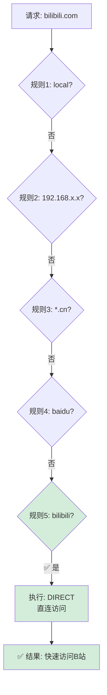

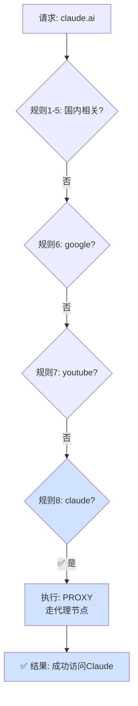

---

## 五、实战案例分析

### 案例1：访问B站（bilibili.com）

#### 全局模式（您当前遇到的问题）

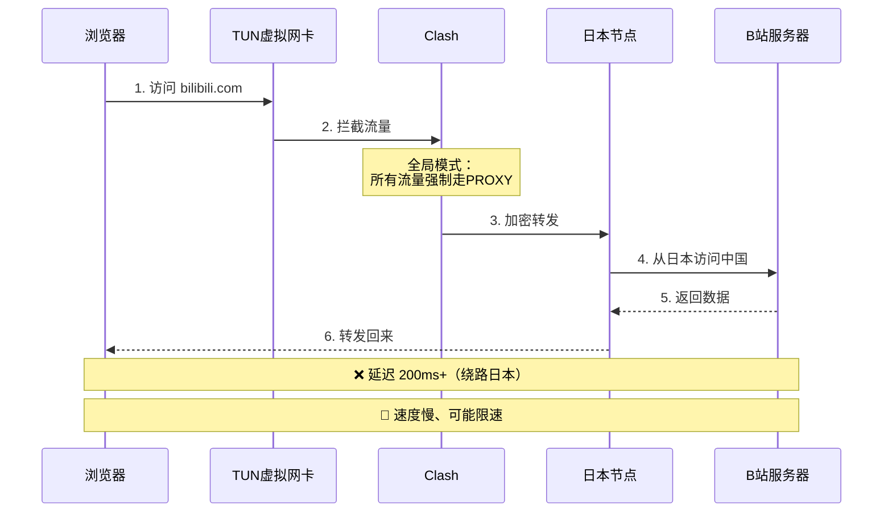

**问题根源**：
- 国内网站也绕到国外 → 延迟增加
- B站可能检测到国外IP → 限速或阻断
- 浪费代理流量

---

#### 规则模式（推荐配置）

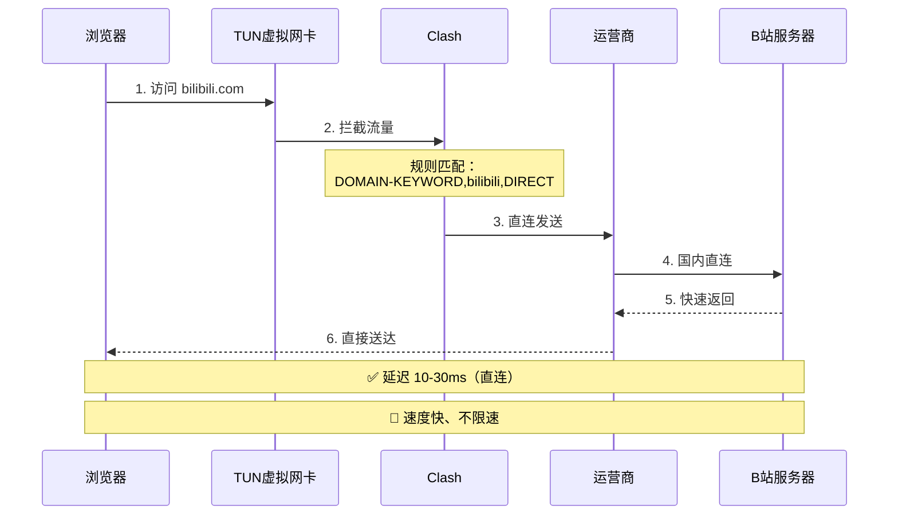

**规则配置**：
```yaml
rules:
  - DOMAIN-KEYWORD,bilibili,DIRECT
  - DOMAIN-SUFFIX,bilibili.com,DIRECT
  - GEOIP,CN,DIRECT
```

---

### 案例2：访问Claude Code（claude.ai）

#### 系统代理模式（不生效）

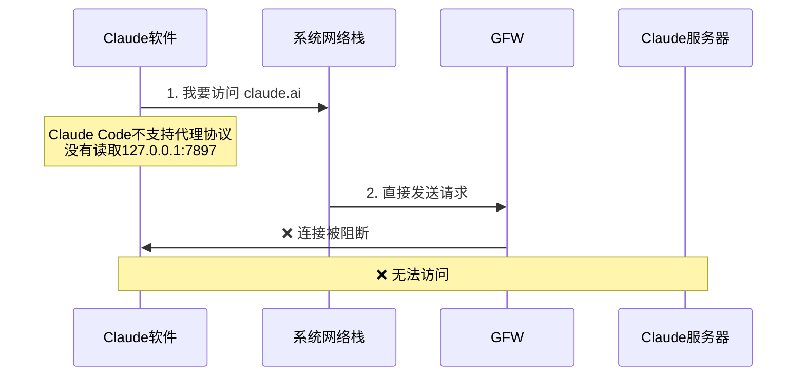

**原因**：
- Claude Code 基于 Electron
- 没有实现系统代理协议读取
- 直接发送请求 → 被墙

---

#### TUN模式（成功）

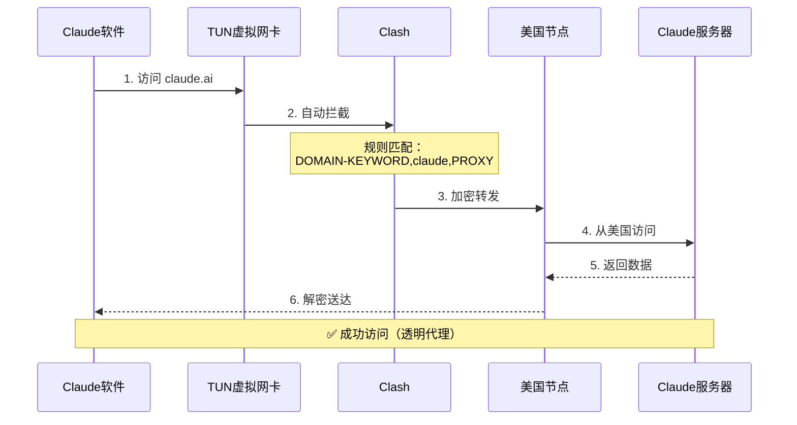

**规则配置**：
```yaml
rules:
  - DOMAIN-KEYWORD,claude,PROXY
  - DOMAIN-KEYWORD,anthropic,PROXY
  - DOMAIN-SUFFIX,claude.ai,PROXY
```

---

### 案例3：完整的混合场景

#### 同时访问国内外网站

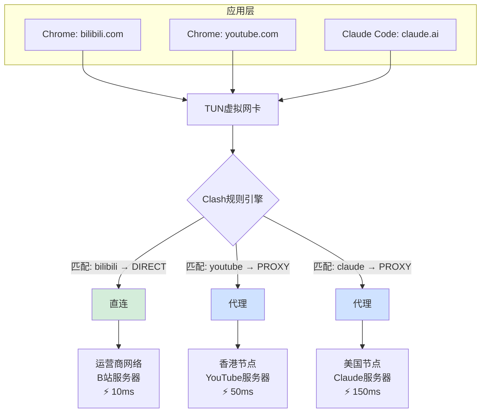

**效果**：
- ✅ B站：直连快速
- ✅ YouTube：代理访问
- ✅ Claude：代理访问
- ✅ 所有应用都生效（TUN模式）

---

## 六、常见问题解答

### Q1：为什么全局模式下访问国内网站慢？

> [!warning] 原因
> **全局模式 = 强制所有流量走代理**

```
您的网络 → 日本节点 → B站（中国）
   ↑                              ↓
   └──────── 绕了一大圈 ──────────┘
```

**解决方案**：切换到**规则模式**，让国内流量直连。

---

### Q2：规则模式和全局模式有什么区别？

| 模式 | 流量路由 | 适用场景 |
|------|---------|---------|
| **规则模式** | 根据规则智能分流 | 日常使用（推荐） |
| **全局模式** | 所有流量强制走代理 | 临时测试、特殊需求 |
| **直连模式** | 所有流量都不走代理 | 不需要代理时 |

---

### Q3：为什么设置了系统代理，Claude Code还是不生效？

> [!info] 技术原因
> **系统代理 = 应用层协议**，需要应用主动实现。

**不支持的应用**：
- Claude Code（Electron，未实现）
- 某些终端工具（不读取系统代理）
- 游戏客户端（直连网络栈）

**解决方案**：
1. 使用 **TUN模式**（一劳永逸）
2. 设置**环境变量**（每次启动前）
3. 使用**启动脚本**（自动化）

---

### Q4：TUN模式会影响游戏延迟吗？

> [!tip] 配置建议
> 在规则中添加游戏服务器直连规则。

```yaml
rules:
  # 游戏服务器直连
  - DOMAIN-SUFFIX,riotgames.com,DIRECT     # 英雄联盟
  - DOMAIN-SUFFIX,pubg.com,DIRECT          # 吃鸡
  - IP-CIDR,103.10.124.0/24,DIRECT         # 游戏服务器IP段
```

**效果**：
- ✅ 游戏流量直连 → 低延迟
- ✅ 网页浏览智能分流 → 快速访问

---

### Q5：我的配置文件应该怎么写？

#### 推荐配置模板

```yaml
# Clash Verge 配置文件

mode: rule  # 使用规则模式
allow-lan: true
log-level: info

# DNS配置（重要！）
dns:
  enable: true
  enhanced-mode: fake-ip
  nameserver:
    - 223.5.5.5       # 阿里DNS
    - 119.29.29.29    # 腾讯DNS
  fallback:
    - 1.1.1.1         # Cloudflare
    - 8.8.8.8         # Google

# TUN模式配置
tun:
  enable: true
  stack: system
  dns-hijack:
    - any:53

# 规则配置
rules:
  # 1. 局域网直连
  - DOMAIN-SUFFIX,local,DIRECT
  - IP-CIDR,192.168.0.0/16,DIRECT
  - IP-CIDR,10.0.0.0/8,DIRECT

  # 2. 国内常用网站直连
  - DOMAIN-KEYWORD,baidu,DIRECT
  - DOMAIN-KEYWORD,taobao,DIRECT
  - DOMAIN-KEYWORD,jd,DIRECT
  - DOMAIN-KEYWORD,bilibili,DIRECT
  - DOMAIN-KEYWORD,qq,DIRECT
  - DOMAIN-KEYWORD,aliyun,DIRECT
  - DOMAIN-SUFFIX,cn,DIRECT

  # 3. 国外服务走代理
  - DOMAIN-KEYWORD,google,PROXY
  - DOMAIN-KEYWORD,youtube,PROXY
  - DOMAIN-KEYWORD,github,PROXY
  - DOMAIN-KEYWORD,claude,PROXY
  - DOMAIN-KEYWORD,openai,PROXY

  # 4. 地理位置规则
  - GEOIP,CN,DIRECT

  # 5. 兜底规则
  - MATCH,PROXY
```

---

## 七、完整工作流程总结

### 终极流程图

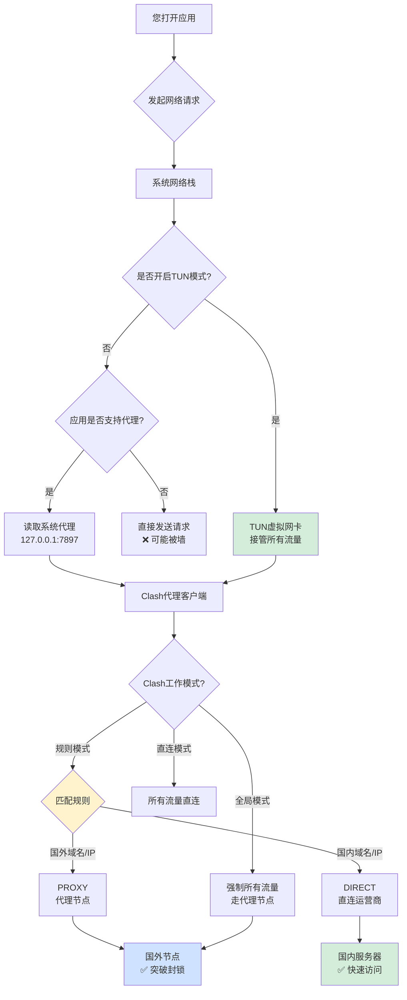

---

## 八、关键概念速查表

| 概念          | 简单理解               | 技术层级         |
| ----------- | ------------------ | ------------ |
| **系统代理**    | 应用主动问："我该走哪里？"     | 应用层（Layer 7） |
| **TUN虚拟网卡** | 系统强制劫持："你必须走这里！"   | 网络层（Layer 3） |
| **全局模式**    | 所有流量都走代理（绕路）       | Clash策略      |
| **规则模式**    | 根据规则智能分流（推荐）       | Clash策略      |
| **直连模式**    | 所有流量都不走代理          | Clash策略      |
| **DIRECT**  | 不经过代理，直接访问         | Clash规则动作    |
| **PROXY**   | 通过代理节点转发           | Clash规则动作    |
| **规则**      | 告诉Clash："这个网站该怎么走" | Clash配置      |

---

## 九、推荐配置方案

### 方案：TUN模式 + 规则分流

```yaml
✅ 优势：
- 所有应用自动生效（浏览器、Claude Code、终端）
- 国内网站快速直连
- 国外网站智能代理
- 无需手动配置环境变量

🎯 适用场景：
- 日常使用
- 开发工作
- 混合访问国内外网站
```

---

## 十、参考资源

- [[网络基础知识]]
- [[Clash配置详解]]
- [[代理协议对比]]

---

> [!success] 学习检查
> 阅读完本文后，您应该能够理解：
> - ✅ 为什么全局模式下访问国内网站慢
> - ✅ TUN模式和系统代理的区别
> - ✅ Clash规则是如何工作的
> - ✅ 如何配置规则实现智能分流
> - ✅ 为什么Claude Code需要TUN模式

---

**最后更新**：2026-01-29
**作者**：Craft Agent
**标签**：#网络原理 #代理 #Clash #TUN模式 #技术教程
