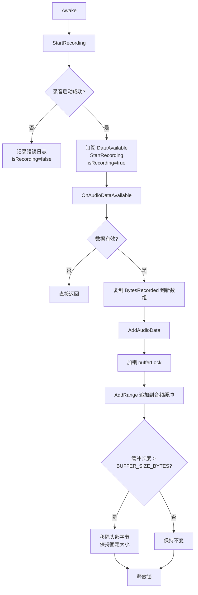
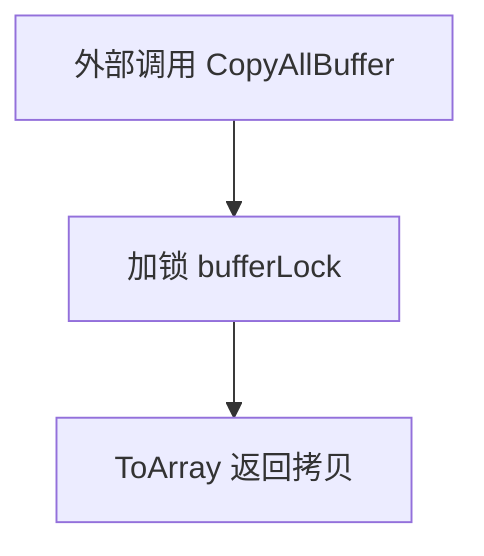
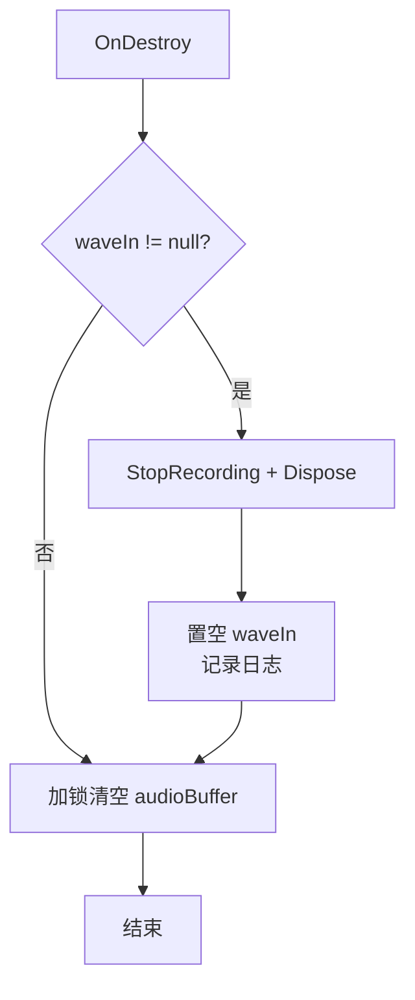

# AudioBufferManager.cs 流程图与说明

  

目标：描述 `AudioBufferManager` 的采集、缓冲、读取与销毁流程，便于理解 VAD 音频链路的上游数据来源。

  

## 1. 主流程（Mermaid）

  



  

## 2. 读取接口流程

  

```mermaid

flowchart TD

  A[外部调用 ReadFromHead(sampleCount)] --> B[bytesNeeded = sampleCount * 2]

  B --> C[加锁 bufferLock]

  C --> D{缓冲长度 >= bytesNeeded?}

  D -- 否 --> E[返回 null]

  D -- 是 --> F[CopyTo 头部 bytesNeeded]

  F --> G[返回字节数组]

```

  



  

```mermaid

flowchart TD

  A[外部调用 HasEnoughData(sampleCount)] --> B[bytesNeeded = sampleCount * 2]

  B --> C[加锁 bufferLock]

  C --> D[返回 Count >= bytesNeeded]

```

  

## 3. 退出与清理流程

  



  

## 4. 关键点说明

- 音频采集使用 NAudio `WaveInEvent`，采样率 16kHz、16-bit、单声道。

- 缓冲区采用 `List<byte>`，通过 `bufferLock` 保证线程安全。

- `BUFFER_SIZE_BYTES` 固定为 16000（约 0.5 秒音频），超过时从头部丢弃旧数据。

- `ReadFromHead` 仅复制数据，不会消费/移除数据。