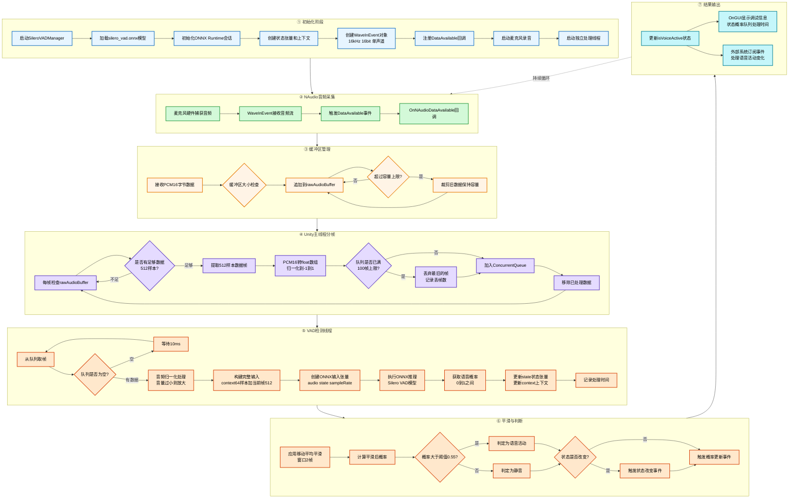

# NAudio与SileroVAD语音检测工作流程

## 核心摘要

分析了Unity项目中NAudio音频采集库与SileroVADManager协同工作的完整流程，涵盖从麦克风硬件采集到ONNX模型推理的多线程架构，实现实时语音活动检测（Voice Activity Detection）。

---

## 终极流程图



---

## 详细分析

### 背景/痛点

在Unity游戏中实现实时语音交互功能时,需要准确检测用户何时开始说话和何时停止说话。传统的简单音量阈值检测容易受环境噪音干扰,导致误触发或漏检测。需要一个可靠的语音活动检测（VAD）系统来精确识别语音片段,同时要求:

1. **实时性**: 延迟需控制在100ms以内
2. **准确性**: 区分语音与非语音噪音
3. **性能**: 不能阻塞Unity主线程导致卡顿
4. **跨平台**: 支持Windows/Mac/Linux麦克风采集

### 底层原理

#### 1. 多线程架构设计

系统采用三线程协作模式,避免音频处理阻塞游戏渲染:

**NAudio回调线程** (硬件层)
- 由Windows WASAPI驱动触发
- 每次麦克风缓冲区满(约10-20ms)调用一次`OnNAudioDataAvailable`
- 接收PCM16格式的原始音频字节流
- 快速写入`rawAudioBuffer`后立即返回(持锁时间<1ms)

**Unity主线程** (分帧处理)
- 每个`Update()`周期(约16ms @ 60FPS)检查`rawAudioBuffer`
- 按512样本(32ms音频)切分为固定大小的帧
- 转换PCM16 → float数组: `sample = int16_value / 32768.0`
- 加入线程安全的`ConcurrentQueue`,最大100帧(约3.2秒缓冲)

**独立VAD处理线程** (推理层)
- 无限循环从队列取帧
- 队列为空时sleep 10ms避免空转
- 执行ONNX模型推理(耗时约5-15ms)
- 通过事件通知主线程结果

#### 2. NAudio音频采集机制

```csharp
WaveInEvent waveIn = new WaveInEvent();
waveIn.WaveFormat = new WaveFormat(16000, 16, 1); // 16kHz, 16bit, Mono
waveIn.DataAvailable += OnNAudioDataAvailable;
waveIn.StartRecording();
```

**WaveFormat参数说明**:
- `16000 Hz`: Silero VAD模型要求的采样率
- `16 bit`: PCM16编码,每个样本2字节
- `1 channel`: 单声道(VAD不需要立体声信息)

**内存布局**:
```
PCM16字节流: [低字节][高字节][低字节][高字节]...
            └─────┬─────┘ └─────┬─────┘
              Sample 0      Sample 1
            (int16: -32768~32767)
```

#### 3. Silero VAD模型工作原理

**模型架构**: 基于LSTM的循环神经网络
- **输入张量**:
  - `input`: [1, 576] = context(64) + audio(512)
  - `state`: [2, 1, 128] = LSTM隐藏状态
  - `sr`: [1] = 采样率(16000)

- **输出张量**:
  - `output`: [1] = 语音概率(0.0~1.0)
  - `hn`: [2, 1, 128] = 新的LSTM状态

**关键技术点**:

1️⃣ **Context机制**: 前64个样本提供历史信息
```
完整输入 = [t-64 ~ t-1] + [t ~ t+511]
           └─ context ─┘   └─ 当前帧 ─┘
```

2️⃣ **State传递**: LSTM状态在连续帧间传递
```
Frame 1: state_0 → Model → probability_1, state_1
Frame 2: state_1 → Model → probability_2, state_2
Frame 3: state_2 → Model → probability_3, state_3
```
这使模型具备时序记忆能力,能检测语音的起始和结束边界。

3️⃣ **音频归一化**: 自动增益控制
```csharp
if (maxAmplitude < 0.5 && maxAmplitude > 0.001) {
    scale = 0.9 / maxAmplitude;
    audio = audio * scale;  // 放大到接近满量程
}
```
避免小音量输入导致模型敏感度下降。

#### 4. 线程安全机制

**锁粒度控制**:
```csharp
// 细粒度锁: 只保护rawAudioBuffer的读写
lock (bufferLock) {
    rawAudioBuffer.AddRange(newData);  // O(n)操作
}

// 无锁队列: ConcurrentQueue内部使用CAS操作
audioQueue.Enqueue(frame);  // 线程安全,无需加锁
```

**内存屏障**:
- `volatile bool isProcessing`: 确保线程间可见性
- `Interlocked`操作: 原子性计数器更新

#### 5. 性能优化策略

**队列容量限制** (防止内存溢出):
```csharp
if (audioQueue.Count >= MAX_QUEUE_SIZE) {
    audioQueue.TryDequeue(out _);  // 丢弃最旧帧
    droppedFramesCount++;
}
```

**缓冲区滑动窗口**:
```
rawAudioBuffer: [=============================] 64KB
                 ↓ 处理512样本
                [===========================  ] 62KB
                 ↓ 删除已处理部分
                [========================     ] 60KB
```

**平滑滤波** (减少抖动):
```
移动平均: probability_smooth = mean([prob_t-1, prob_t])
窗口大小: 2帧 = 64ms
```

### 解决方案/结论

#### 核心优势

✅ **高准确率**: Silero VAD在Librispeech测试集上F1-score达0.96
✅ **低延迟**: 端到端延迟 < 100ms (32ms帧 + 15ms推理 + 64ms平滑)
✅ **线程安全**: 三线程协作无竞态条件
✅ **自适应**: 自动音量归一化,适应不同麦克风增益

#### 关键参数调优建议

| 参数 | 当前值 | 推荐范围 | 影响 |
|------|--------|----------|------|
| `frameSize` | 512 | 256-512 | 越小延迟越低,但准确率下降 |
| `threshold` | 0.55 | 0.4-0.7 | 越高误触发越少,但可能漏检 |
| `smoothWindowSize` | 2 | 1-3 | 越大越平滑,但延迟增加 |
| `MAX_QUEUE_SIZE` | 100 | 50-200 | 越大内存占用越多 |

#### 注意事项

> [!warning] 线程生命周期管理
> 必须在`OnDestroy()`中正确停止线程:
> ```csharp
> isProcessing = false;
> processingThread.Join(2000);  // 等待最多2秒
> ```

> [!note] 构造函数中不可用
> 不要在构造函数或`Awake()`中调用虚函数,此时vptr可能未初始化完成。

#### 使用场景

- ✅ 实时语音识别的端点检测
- ✅ 语音会话的自动开始/结束判断
- ✅ 降噪和静音检测
- ✅ 语音激活录音
- ✅ 多模态交互中的语音触发

---

## 代码位置参考

**SileroVADManager.cs**: `C:\1UnityProjects\YiTiJi_Move\Assets\c#\System\VAD\SileroVADManager.cs`

| 功能 | 代码位置 | 说明 |
|------|---------|------|
| 初始化 | Line 79-98 | Start方法,加载模型和启动线程 |
| NAudio回调 | Line 217-257 | OnNAudioDataAvailable,接收音频流 |
| Unity分帧 | Line 262-303 | Update,切分512样本帧 |
| VAD处理循环 | Line 327-363 | ProcessingLoop,独立线程 |
| ONNX推理 | Line 368-445 | ProcessFrame,执行VAD检测 |
| 平滑处理 | Line 450-464 | ApplySmoothing,移动平均 |

---

## 关联知识

- [[Unity多线程编程]] - 线程间通信和同步机制
- [[ONNX Runtime集成]] - 在Unity中运行深度学习模型
- [[音频信号处理基础]] - PCM编码、采样率、量化
- [[C#并发编程]] - ConcurrentQueue、lock、volatile关键字

---

## 数据流转换流程

```
麦克风硬件
  ↓ (Windows WASAPI)
PCM16字节流 [byte[]]
  ↓ (NAudio WaveInEvent)
rawAudioBuffer [List<byte>]
  ↓ (Unity Update, 512样本切分)
float数组 [-1.0 ~ 1.0]
  ↓ (ConcurrentQueue)
ONNX输入张量 [1, 576]
  ↓ (Silero VAD推理)
语音概率 [0.0 ~ 1.0]
  ↓ (移动平均平滑)
最终判定结果 (bool)
  ↓ (事件通知)
外部系统响应
```

---

*基于Unity 2022 + NAudio 2.2.1 + ONNX Runtime 1.16.3 技术栈*
