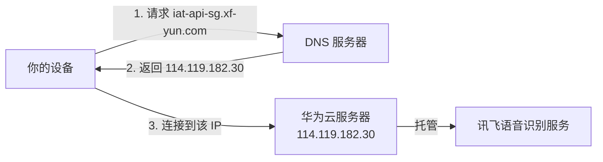

## 逐个解答

### 1. 114.119.182.30 是什么？

这是一个 **华为云服务器的 IP 地址**，位于亚太地区（可能是新加坡机房）。

| 属性 | 值 |
|------|-----|
| 所属组织 | 华为 (Huawei) |
| IP 段 | 114.119.128.0 - 114.119.191.255 |
| ASN | AS136907 |

---

### 2. iat-api-sg.xf-yun.com 是什么？

这是 **科大讯飞** 的语音识别 API 服务地址：

- `iat` = Intelligent Audio Transcription（语音听写）
- `sg` = Singapore（新加坡节点，海外版）
- `xf-yun.com` = 讯飞云

用于实时语音转文字服务，通过 WebSocket 连接（`wss://`）。

---

### 3. 两者的关系

**简单说：** 讯飞把海外语音识别服务部署在华为云上。域名是"门牌名"，IP 是"实际地址"。

---

### 4. DNS 是什么？

**DNS = Domain Name System（域名系统）**

人类记不住数字 IP，所以发明了域名。DNS 就是互联网的"电话簿"：

| 你输入 | DNS 返回 |
|--------|----------|
| `baidu.com` | `39.156.66.10` |
| `iat-api-sg.xf-yun.com` | `114.119.182.30` |

你截图里的 **DNS: 10.6ms** 就是查这个"电话簿"花的时间。

---

### 5. TLS 是什么？

**TLS = Transport Layer Security（传输层安全协议）**

用于加密你和服务器之间的通信，防止被窃听或篡改。

| 没有 TLS | 有 TLS |
|----------|--------|
| `http://` | `https://` |
| `ws://` | `wss://` |
| 明文传输，可被偷看 | 加密传输，安全 |

你截图里的 **TLS: 132.6ms** 是双方"交换密钥、建立加密通道"花的时间（这步最耗时）。

---

**Sources:**
- [讯飞语音识别 API 文档](https://www.xfyun.cn/doc/spark/spark_zh_iat.html)
- [iFLYTEK Global ASR API](https://global.xfyun.cn/doc/asr/voicedictation/API.html)
- [APNIC IP 资源](https://www.apnic.net/manage-ip/manage-resources/address-status/apnic-resource-range/)